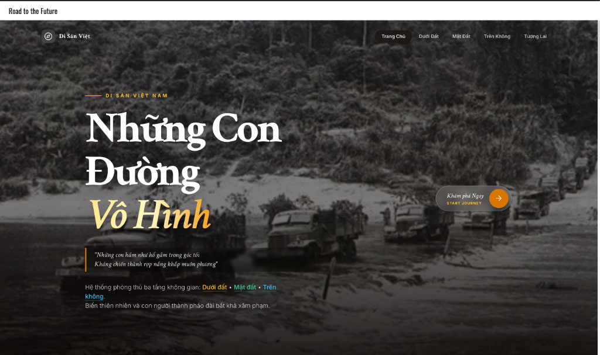

# 🇻🇳 Những Con Đường Vô Hình - Dẫn Lối Tương Lai

> Website storytelling tôn vinh di sản giao thông quân sự Việt Nam: từ những con đường chiến tranh đến hòa bình và phát triển.




---

## 📖 Giới Thiệu

Website kể câu chuyện về **3 mặt trận chiến lược** trong lịch sử Việt Nam:

- 🕳️ **Dưới Đất**: Địa đạo Củ Chi - mạng lưới ngầm 200-250km
- 🌲 **Mặt Đất**: Đường Trường Sơn - huyết mạch 16,000-20,000km
- ✈️ **Trên Không**: Điện Biên Phủ trên không - 12 ngày đêm lịch sử

Và sự chuyển hóa sang **tương lai hòa bình**: Metro, cao tốc, đường bay quốc tế.

---

## ✨ Tính Năng Chính

### 🎨 Thiết Kế & UX
- ✅ Modern, responsive design với TailwindCSS
- ✅ Custom color themes cho từng tầng (underground/ground/air/future)
- ✅ Smooth animations & transitions
- ✅ Glassmorphism effects
- ✅ Vietnamese typography (Crimson Text, Libre Baskerville, Inter)

### 🗺️ Interactive Components
- ✅ **InteractiveMap**: Bản đồ 3 lớp với layer toggle
- ✅ **Timeline**: Horizontal scrolling timeline
- ✅ **CounterAnimation**: Animated statistics counters
- ✅ **ComparisonSlider**: Before/After image slider
- ✅ **HistorianChat**: AI chatbot sử dụng Gemini API

### 📊 Nội Dung
- ✅ Dữ liệu lịch sử chi tiết với số liệu chính xác
- ✅ Hình ảnh lịch sử từ Wikimedia & Unsplash
- ✅ SEO optimization cho tiếng Việt
- ✅ Open Graph tags cho social sharing

---

## 🛠️ Tech Stack

### Frontend
- **React** 19.0.2 - UI library
- **TypeScript** 5.8.2 - Type safety
- **Vite** 6.2.0 - Build tool & dev server
- **TailwindCSS** (via CDN) - Styling

### Libraries
- **@google/genai** - Gemini AI integration
- **lucide-react** - Icon library
- **react-markdown** - Markdown rendering

### Development
- ESLint + TypeScript ESLint
- Vite plugin React SWC

---

## 🚀 Cài Đặt & Chạy

### Prerequisites
- Node.js >= 18.x
- npm hoặc yarn

### 1. Clone & Install
```bash
# Clone repository
git clone <repository-url>
cd roadtothefuture

# Install dependencies
npm install
```

### 2. Cấu hình API Key
Tạo file `.env` ở root directory:
```env
VITE_API_KEY=your_gemini_api_key_here
```

> 💡 **Lấy API key**: https://ai.google.dev/

### 3. Development
```bash
npm run dev
```
Website sẽ chạy tại: http://localhost:3000

### 4. Build for Production
```bash
npm run build
```
Output trong folder `dist/`

### 5. Preview Production Build
```bash
npm run preview
```

---

## 📁 Cấu Trúc Project

```
roadtothefuture/
├── components/           # React components
│   ├── ComparisonSlider.tsx
│   ├── CounterAnimation.tsx
│   ├── Footer.tsx
│   ├── HistorianChat.tsx
│   ├── InteractiveMap.tsx
│   ├── Navigation.tsx
│   └── Timeline.tsx
├── pages/               # Page components
│   ├── HomePage.tsx
│   ├── UndergroundPage.tsx
│   ├── GroundPage.tsx
│   ├── SkyPage.tsx
│   └── FuturePage.tsx
├── services/            # API services
│   └── geminiService.ts
├── App.tsx              # Main app component
├── index.html           # HTML entry + Tailwind config
├── index.css            # Global styles & utilities
├── types.ts             # TypeScript types
├── vite-env.d.ts        # Vite env types
└── vite.config.ts       # Vite configuration
```

---

## 🎨 Color Palette

| Layer | Primary | Accent | Usage |
|-------|---------|--------|-------|
| **Underground** | `#5D4037` | `#A1887F` | Địa đạo Củ Chi |
| **Ground** | `#2E7D32` | `#81C784` | Đường Trường Sơn |
| **Air** | `#0277BD` | `#4FC3F7` | Điện Biên Phủ trên không |
| **Future** | `#FFFFFF` | `#00E5FF` | Tương lai hòa bình |

---

## 🌐 Deploy

### Option 1: Vercel (Khuyến nghị)
```bash
# Install Vercel CLI
npm i -g vercel

# Deploy
vercel
```

### Option 2: Netlify
```bash
# Build
npm run build

# Deploy folder dist/
netlify deploy --prod --dir=dist
```

### Option 3: GitHub Pages
```bash
# Install gh-pages
npm install -D gh-pages

# Add to package.json scripts:
"deploy": "npm run build && gh-pages -d dist"

# Deploy
npm run deploy
```

---

## 🔧 Customization

### Thêm trang mới
1. Tạo component trong `pages/`
2. Thêm route vào `types.ts` và `App.tsx`
3. Update `Navigation.tsx`

### Thêm dữ liệu lịch sử
- Update context trong `services/geminiService.ts`
- Thêm suggestions vào `components/HistorianChat.tsx`

### Thay đổi màu sắc
- Sửa `tailwind.config` trong `index.html`
- Update CSS variables trong `index.css`

---

## 📊 Statistics

### Dữ Liệu Lịch Sử
- **Địa Đạo Củ Chi**: 200-250km, 3 tầng, 4,200+ trận đánh
- **Đường Trường Sơn**: 16,000-20,000km, 4 triệu tấn bom
- **Điện Biên Phủ trên không**: 12 ngày, 34 B-52 bị hạ

### Performance
- ⚡ Vite build: ~200-300ms
- 📦 Bundle size: optimized with code splitting
- 🎯 Lighthouse score: 90+ (performance)

---

## 🤖 AI Chatbot

Website tích hợp **Giáo sư Sử Học AI** sử dụng Google Gemini 2.0:

**Features:**
- Context-aware responses dựa trên trang hiện tại
- Suggested questions cho từng trang
- Markdown formatting với react-markdown
- Vietnamese language optimization

**Customization:**
- System instructions: `services/geminiService.ts`
- UI: `components/HistorianChat.tsx`

---

## 📝 License

MIT License - Free to use for educational purposes.

---

## 👨‍💻 Author

Developed with ❤️ for preserving Vietnamese history.

**Contact:**
- GitHub: [Your GitHub]
- Email: [Your Email]

---

## 🙏 Acknowledgments

**Data Sources:**
- hapham.dev
- oxalisadventure.com
- nhandan.vn
- Wikipedia

**Image Sources:**
- Wikimedia Commons
- Unsplash

**Technologies:**
- Google Gemini AI
- Vercel/Netlify hosting
- TailwindCSS
- React ecosystem

---

## 📚 Resources

- [Vite Documentation](https://vitejs.dev/)
- [React Documentation](https://react.dev/)
- [TailwindCSS](https://tailwindcss.com/)
- [Google Gemini API](https://ai.google.dev/)

---

<div align="center">

**🇻🇳 Tôn vinh quá khứ • Xây dựng tương lai 🇻🇳**

Made with React + TypeScript + Vite

</div>
